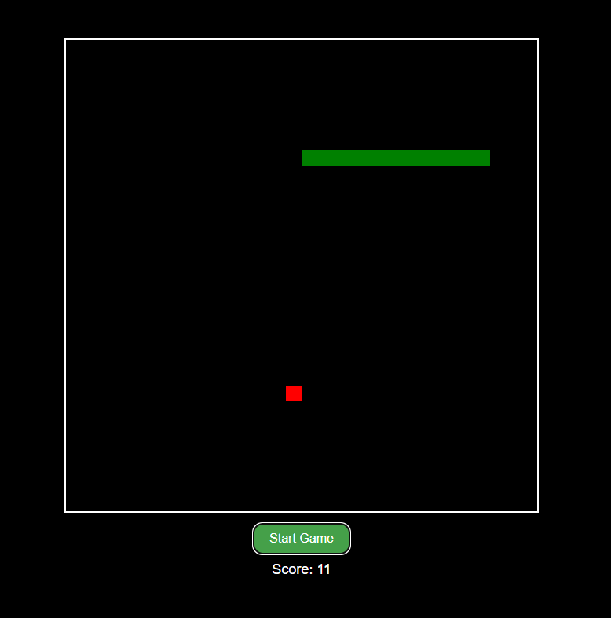

# Snake Game

A simple Snake Game implemented using HTML, CSS, and JavaScript.

## Live Demo

You can play the game [here](https://pakkid.github.io/snake).

## Screenshot



## How to Play

1. Click the "Start Game" button to begin.
2. Use the arrow keys to control the snake:
   - Up: `ArrowUp`
   - Down: `ArrowDown`
   - Left: `ArrowLeft`
   - Right: `ArrowRight`
3. Eat the red food to grow the snake and increase your score.
4. Avoid colliding with the walls or the snake itself.

## Features

- Snake movement controlled by arrow keys.
- Collision detection with walls and self.
- Food consumption and score update.
- Game over screen with final score and retry option.
- Sound effects for eating food and game over.

## Project Structure

```
snake-game
├── css
│   └── style.css
├── js
│   └── script.js
├── sounds
│   ├── eat.mp3
│   └── gameover.mp3
├── index.html
├── screenshot.png
├── LICENSE
└── README.md
```

## License

This project is licensed under the MIT License. See the [LICENSE](LICENSE) file for details.